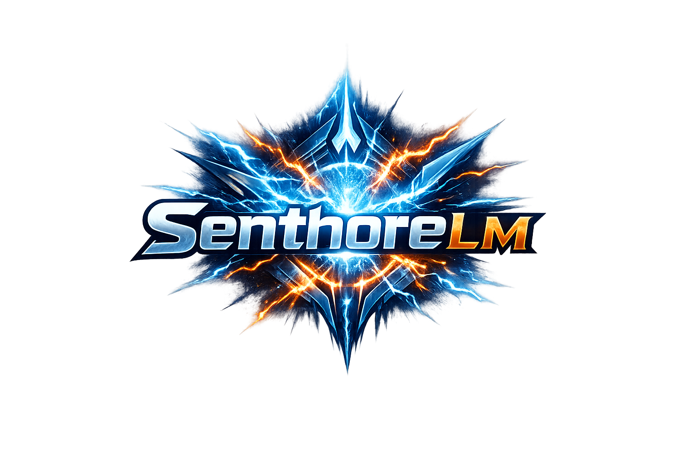

# SenthoreLM | AI Systems, Computer Vision, and Full-Stack Engineering  
Michael Clark | Software Developer  

---

---

## Overview
This repository serves as a comprehensive software engineering and artificial intelligence portfolio, showcasing the development of multiple production-style systems across AI, computer vision, and full-stack web platforms.

The work presented here focuses on building complete, end-to-end systems — not isolated scripts or academic exercises. Each project demonstrates real-world engineering practices including system architecture design, modular development, performance optimization, and scalable infrastructure planning.

---

## Portfolio Focus
- Artificial Intelligence System Design  
- Computer Vision & Real-Time Processing  
- Full-Stack Web Development  
- Backend Architecture & API Integration  
- Data Processing & Analytics Pipelines  
- Scalable System Engineering  

---

## Core Systems

### SenthoreLM (Custom Language Model Framework)

#### Description
SenthoreLM is a custom-designed conversational AI framework that models the internal structure of modern large language systems.

Rather than relying on prebuilt chatbot wrappers, this system focuses on how intelligent systems are structured internally — including input processing, modular pipelines, and response generation workflows.

#### Key Components
- Input parsing and structured data handling  
- Modular AI processing pipeline  
- Response generation architecture  
- Expandable framework for future model integration  
- Clean separation between system layers  

#### Engineering Highlights
- Designed with scalability and extensibility in mind  
- Emphasis on modular system architecture  
- Structured data flow for maintainability  
- Built to simulate real-world AI system design principles  

---

### Real-Time Vision Intelligence System

#### Description
A high-performance computer vision system built using YOLOv8, PyTorch, and OpenCV. This system processes live video streams and generates structured analytics in real time.

#### System Pipeline
Camera → Detection → Logging → Analytics → Visualization → AI Reporting  

#### Features
- Real-time object detection  
- Frame-by-frame performance benchmarking  
- Structured logging using CSV datasets  
- Automated analytics generation  
- AI-assisted reporting for performance insights  

#### Engineering Challenges Solved
- Maintaining consistent real-time performance under load  
- Reducing I/O overhead during logging  
- Designing a modular detection and analytics pipeline  
- Adapting to variable environments and input conditions  

---

### AI Chat System (Custom ChatGPT-Style Architecture)

#### Description
A conversational AI system designed to replicate the structure of modern chatbot frameworks, focusing on backend logic, message handling, and scalable design.

#### Features
- Context-aware response handling  
- Modular backend system design  
- API integration for AI services  
- Expandable architecture for future capabilities  

---

### Full-Stack Web Platforms

#### Hoffmann's Reptile Web Application

#### Description
A fully interactive, database-driven web platform designed to manage and display dynamic content.

#### Features
- Dynamic content rendering using server-side templates  
- Image upload and management system  
- MongoDB database integration with Mongoose  
- Custom administrative controls  
- Responsive and structured frontend design  

#### Technology Stack
- Node.js  
- Express  
- MongoDB (Mongoose)  
- EJS  
- JavaScript, HTML, CSS  

---

## Engineering Approach
The systems in this portfolio are built with a focus on:

- Scalability  
- Modularity  
- Performance optimization  
- Maintainability  
- Real-world applicability  

Each project reflects production-level thinking, emphasizing clean architecture, efficient processing, and long-term extensibility.

---

## Technologies & Tools
- Python  
- C++  
- JavaScript  
- PyTorch  
- OpenCV  
- Node.js / Express  
- MongoDB (Mongoose)  
- Firebase  
- Git / GitHub  

---

## Summary
This portfolio demonstrates the ability to design, build, and deploy complete systems across multiple domains, including artificial intelligence, backend engineering, and full-stack development.

The emphasis is on delivering structured, scalable, and production-ready solutions.

---

## Hashtags
#AI #MachineLearning #ComputerVision #YOLOv8 #PyTorch #OpenCV #DeepLearning #ArtificialIntelligence #SoftwareEngineering #FullStackDevelopment #BackendDevelopment #WebDevelopment #NodeJS #MongoDB #CPlusPlus #Python #RealTimeSystems #SystemDesign #AIEngineering #Portfolio #TechPortfolio #Developer #GitHubProjects #Innovation
