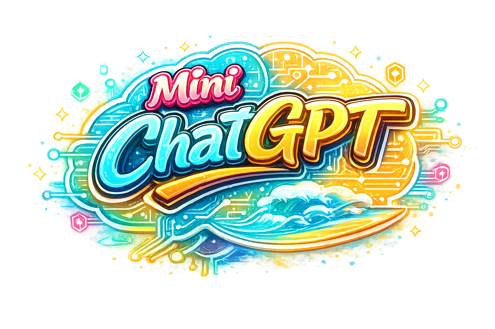

---

### 🧪 Tech Stack
- Python
- PyTorch
- YOLOv8
- OpenCV
- Matplotlib
- AI API Integration

---

### 🧠 Key Features
- Real-time object detection
- Performance benchmarking per frame
- Structured logging (CSV)
- Automated analytics generation
- AI-generated optimization reports

---

### 🧩 Engineering Challenges Solved
- Maintaining real-time performance under load
- Reducing logging overhead
- Designing scalable modular architecture
- Handling variable detection environments

---

### 💼 Real-World Applications
- Surveillance systems
- Smart city infrastructure
- Retail analytics
- Autonomous systems

---

### 🏁 Summary
This project demonstrates the ability to build **complete AI systems**, not just models.

---

## 🤖 Mini ChatGPT AI Framework

### Overview
A modular conversational AI system that replicates the internal pipeline of modern language models.

This is not just a chatbot — it is a **full AI architecture system**.

---

### ⚙️ Architecture
